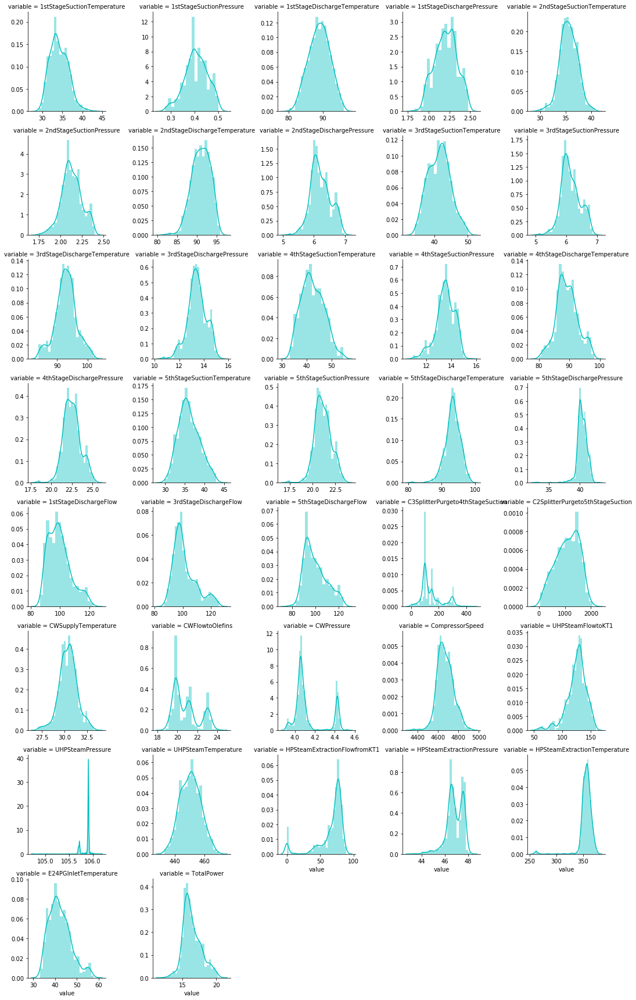
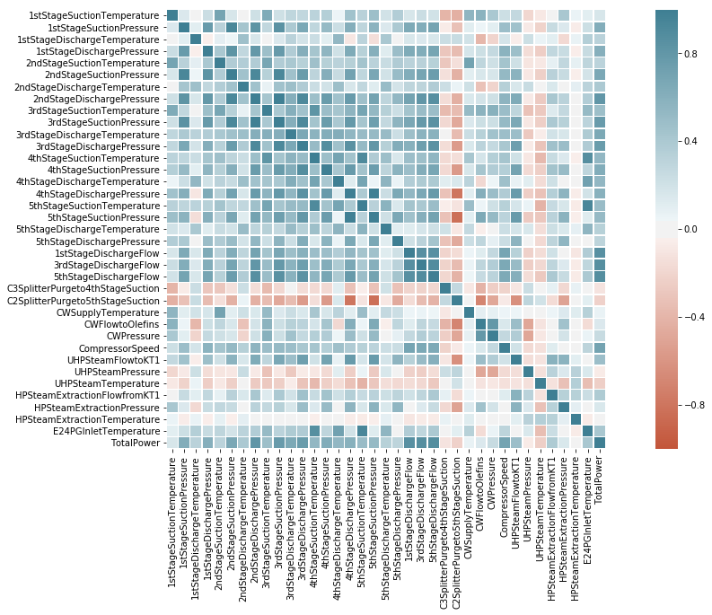

# Loading Libaries


```python
#Common imports
import sys
import os
# Numpy for stastics 
import numpy as np

#Python Data Analysis Library
import pandas as pd

#Data visualization
%matplotlib inline 
#sets the backend of matplotlib to the 'inline' backend
#%matplotlib notebook
import matplotlib 
import seaborn as sns
import matplotlib.pyplot as plt

# Ignore useless warnings (see SciPy issue #5998)
import warnings
warnings.filterwarnings(action="ignore", message="^internal gelsd")

```

# Data import and cleaning

## Data Import


```python
df = pd.read_excel('E:/nikhitha/datasets/CGC/CGC Total Power comsumption.xlsx', sheetname='Sheet1') #loaded or readed the data

```

### View the Dataset


```python
 df.head()
```


<div>
<style scoped>
    .dataframe tbody tr th:only-of-type {
        vertical-align: middle;
    }

    .dataframe tbody tr th {
        vertical-align: top;
    }

    .dataframe thead th {
        text-align: right;
    }
</style>
<table border="1" class="dataframe">
  <thead>
    <tr style="text-align: right;">
      <th></th>
      <th>Description</th>
      <th>UOM</th>
      <th>Type of Data</th>
      <th>Tag</th>
      <th>2014-06-10 00:00:00</th>
      <th>2014-06-11 00:00:00</th>
      <th>2014-06-12 00:00:00</th>
      <th>2014-06-13 00:00:00</th>
      <th>2014-06-14 00:00:00</th>
      <th>2014-06-15 00:00:00</th>
      <th>...</th>
      <th>2017-12-22 00:00:00</th>
      <th>2017-12-23 00:00:00</th>
      <th>2017-12-24 00:00:00</th>
      <th>2017-12-25 00:00:00</th>
      <th>2017-12-26 00:00:00</th>
      <th>2017-12-27 00:00:00</th>
      <th>2017-12-28 00:00:00</th>
      <th>2017-12-29 00:00:00</th>
      <th>2017-12-30 00:00:00</th>
      <th>2017-12-31 00:00:00</th>
    </tr>
  </thead>
  <tbody>
    <tr>
      <th>0</th>
      <td>1st Stage Suction Temperature</td>
      <td>°C</td>
      <td>Measured</td>
      <td>01TI2356-PV</td>
      <td>30.245354</td>
      <td>33.657</td>
      <td>32.857358</td>
      <td>31.50</td>
      <td>30.3</td>
      <td>31.922800</td>
      <td>...</td>
      <td>35.223558</td>
      <td>34.082387</td>
      <td>34.465854</td>
      <td>32.872308</td>
      <td>33.156150</td>
      <td>32.496662</td>
      <td>33.565096</td>
      <td>34.323767</td>
      <td>35.719146</td>
      <td>33.044412</td>
    </tr>
    <tr>
      <th>1</th>
      <td>1st Stage Suction Pressure</td>
      <td>kg/cm2g</td>
      <td>Measured</td>
      <td>01PC2358-PV</td>
      <td>0.420737</td>
      <td>0.354</td>
      <td>0.392626</td>
      <td>0.40</td>
      <td>0.4</td>
      <td>0.424725</td>
      <td>...</td>
      <td>0.372329</td>
      <td>0.366712</td>
      <td>0.442096</td>
      <td>0.353642</td>
      <td>0.397717</td>
      <td>0.449746</td>
      <td>0.431175</td>
      <td>0.428258</td>
      <td>0.491954</td>
      <td>0.499692</td>
    </tr>
    <tr>
      <th>2</th>
      <td>1st Stage Discharge Temperature</td>
      <td>°C</td>
      <td>Measured</td>
      <td>01TI2378-PV</td>
      <td>88.910154</td>
      <td>91.477</td>
      <td>92.121653</td>
      <td>89.07</td>
      <td>87.3</td>
      <td>88.611175</td>
      <td>...</td>
      <td>85.545846</td>
      <td>84.807633</td>
      <td>84.338225</td>
      <td>82.447150</td>
      <td>83.877837</td>
      <td>84.337496</td>
      <td>84.488404</td>
      <td>84.339037</td>
      <td>90.680967</td>
      <td>91.099225</td>
    </tr>
    <tr>
      <th>3</th>
      <td>1st Stage Discharge Pressure</td>
      <td>kg/cm2g</td>
      <td>Measured</td>
      <td>01PI2364-PV</td>
      <td>2.006712</td>
      <td>2.007</td>
      <td>2.038484</td>
      <td>2.00</td>
      <td>2.0</td>
      <td>2.017133</td>
      <td>...</td>
      <td>2.410392</td>
      <td>2.387933</td>
      <td>2.368546</td>
      <td>2.328996</td>
      <td>2.327996</td>
      <td>2.335800</td>
      <td>2.342221</td>
      <td>2.345983</td>
      <td>2.349912</td>
      <td>2.348679</td>
    </tr>
    <tr>
      <th>4</th>
      <td>2nd Stage Suction Temperature</td>
      <td>°C</td>
      <td>Measured</td>
      <td>01TI2402-PV</td>
      <td>32.622496</td>
      <td>32.967</td>
      <td>34.982900</td>
      <td>34.40</td>
      <td>33.0</td>
      <td>34.457996</td>
      <td>...</td>
      <td>37.430446</td>
      <td>35.956879</td>
      <td>36.735058</td>
      <td>33.056492</td>
      <td>33.887275</td>
      <td>35.249033</td>
      <td>36.143021</td>
      <td>35.829054</td>
      <td>37.922896</td>
      <td>34.827075</td>
    </tr>
  </tbody>
</table>
<p>5 rows × 1184 columns</p>
</div>


```python
df.info()
```

    <class 'pandas.core.frame.DataFrame'>
    RangeIndex: 37 entries, 0 to 36
    Columns: 1184 entries, Description to 2017-12-31 00:00:00
    dtypes: float64(1178), object(6)
    memory usage: 342.3+ KB
    

## Removing the Unnecessary columns


```python
df1 =df.drop(columns = ["UOM","Type of Data", "Tag"]) # drop the unnecessary columns
```

## Finding Dimensions of data


```python
df1.shape
```


    (37, 1181)


This data consisting of 37 rows and 1181 columns,which is unstructed form, so we need to make them into structed form by converting rows to columns and vice versa

# Transpose of data


```python
df1 = df1.T.reset_index() # transpose the dataset converting rows to colmns and columns to rows
df1.head()
```


<div>
<style scoped>
    .dataframe tbody tr th:only-of-type {
        vertical-align: middle;
    }

    .dataframe tbody tr th {
        vertical-align: top;
    }

    .dataframe thead th {
        text-align: right;
    }
</style>
<table border="1" class="dataframe">
  <thead>
    <tr style="text-align: right;">
      <th></th>
      <th>index</th>
      <th>0</th>
      <th>1</th>
      <th>2</th>
      <th>3</th>
      <th>4</th>
      <th>5</th>
      <th>6</th>
      <th>7</th>
      <th>8</th>
      <th>...</th>
      <th>27</th>
      <th>28</th>
      <th>29</th>
      <th>30</th>
      <th>31</th>
      <th>32</th>
      <th>33</th>
      <th>34</th>
      <th>35</th>
      <th>36</th>
    </tr>
  </thead>
  <tbody>
    <tr>
      <th>0</th>
      <td>Description</td>
      <td>1st Stage Suction Temperature</td>
      <td>1st Stage Suction Pressure</td>
      <td>1st Stage Discharge Temperature</td>
      <td>1st Stage Discharge Pressure</td>
      <td>2nd Stage Suction Temperature</td>
      <td>2nd Stage Suction Pressure</td>
      <td>2nd Stage Discharge Temperature</td>
      <td>2nd Stage Discharge Pressure</td>
      <td>3rd Stage Suction Temperature</td>
      <td>...</td>
      <td>CW Pressure</td>
      <td>Compressor Speed</td>
      <td>UHP Steam Flow to KT-1</td>
      <td>UHP Steam Pressure</td>
      <td>UHP Steam Temperature</td>
      <td>HP Steam Extraction Flow from KT-1</td>
      <td>HP Steam Extraction Pressure</td>
      <td>HP Steam Extraction Temperature</td>
      <td>E-24 PG Inlet Temperature</td>
      <td>Total Power</td>
    </tr>
    <tr>
      <th>1</th>
      <td>2014-06-10 00:00:00</td>
      <td>30.2454</td>
      <td>0.420737</td>
      <td>88.9102</td>
      <td>2.00671</td>
      <td>32.6225</td>
      <td>2.0983</td>
      <td>91.5992</td>
      <td>5.83635</td>
      <td>34.8865</td>
      <td>...</td>
      <td>4.1175</td>
      <td>4554.04</td>
      <td>94.6215</td>
      <td>105.489</td>
      <td>464.566</td>
      <td>25.5534</td>
      <td>45.3681</td>
      <td>368.727</td>
      <td>33.0434</td>
      <td>13.8885</td>
    </tr>
    <tr>
      <th>2</th>
      <td>2014-06-11 00:00:00</td>
      <td>33.657</td>
      <td>0.354</td>
      <td>91.477</td>
      <td>2.007</td>
      <td>32.967</td>
      <td>1.934</td>
      <td>91.405</td>
      <td>5.407</td>
      <td>34.709</td>
      <td>...</td>
      <td>4.075</td>
      <td>4546.4</td>
      <td>98.9756</td>
      <td>105.696</td>
      <td>459.615</td>
      <td>39.6966</td>
      <td>45.3875</td>
      <td>368.215</td>
      <td>33.399</td>
      <td>13.5798</td>
    </tr>
    <tr>
      <th>3</th>
      <td>2014-06-12 00:00:00</td>
      <td>32.8574</td>
      <td>0.392626</td>
      <td>92.1217</td>
      <td>2.03848</td>
      <td>34.9829</td>
      <td>2.07911</td>
      <td>94.0512</td>
      <td>5.82529</td>
      <td>37.0767</td>
      <td>...</td>
      <td>4.05212</td>
      <td>4601.99</td>
      <td>103.414</td>
      <td>105.709</td>
      <td>459.159</td>
      <td>40.9557</td>
      <td>45.6778</td>
      <td>367.63</td>
      <td>36.6697</td>
      <td>14.6584</td>
    </tr>
    <tr>
      <th>4</th>
      <td>2014-06-13 00:00:00</td>
      <td>31.5</td>
      <td>0.4</td>
      <td>89.07</td>
      <td>2</td>
      <td>34.4</td>
      <td>2.11</td>
      <td>92.03</td>
      <td>6</td>
      <td>36.9</td>
      <td>...</td>
      <td>4.075</td>
      <td>4508.8</td>
      <td>111.3</td>
      <td>105.7</td>
      <td>451.9</td>
      <td>39.88</td>
      <td>45.87</td>
      <td>361.19</td>
      <td>36.9915</td>
      <td>14.7133</td>
    </tr>
  </tbody>
</table>
<p>5 rows × 38 columns</p>
</div>


 ### Assigning the first row of the dataset to  Column header


```python
 header = df1.iloc[0] # assigning the first row of the dataset to header
 header
```


    index                               Description
    0                 1st Stage Suction Temperature
    1                    1st Stage Suction Pressure
    2               1st Stage Discharge Temperature
    3                  1st Stage Discharge Pressure
    4                 2nd Stage Suction Temperature
    5                    2nd Stage Suction Pressure
    6               2nd Stage Discharge Temperature
    7                  2nd Stage Discharge Pressure
    8                 3rd Stage Suction Temperature
    9                    3rd Stage Suction Pressure
    10              3rd Stage Discharge Temperature
    11                 3rd Stage Discharge Pressure
    12                4th Stage Suction Temperature
    13                   4th Stage Suction Pressure
    14              4th Stage Discharge Temperature
    15                 4th Stage Discharge Pressure
    16                5th Stage Suction Temperature
    17                   5th Stage Suction Pressure
    18              5th Stage Discharge Temperature
    19                 5th Stage Discharge Pressure
    20                     1st Stage Discharge Flow
    21                     3rd Stage Discharge Flow
    22                     5th Stage Discharge Flow
    23       C3 Splitter Purge to 4th Stage Suction
    24       C2 Splitter Purge to 5th Stage Suction
    25                        CW Supply Temperature
    26                           CW Flow to Olefins
    27                                  CW Pressure
    28                             Compressor Speed
    29                       UHP Steam Flow to KT-1
    30                           UHP Steam Pressure
    31                        UHP Steam Temperature
    32           HP Steam Extraction Flow from KT-1
    33                 HP Steam Extraction Pressure
    34              HP Steam Extraction Temperature
    35                    E-24 PG Inlet Temperature
    36                                  Total Power
    Name: 0, dtype: object


### Loading the data of all rows and columns


```python
df1 = df1[1:] # loading the data of all rows and columns
df1.head()
```


<div>
<style scoped>
    .dataframe tbody tr th:only-of-type {
        vertical-align: middle;
    }

    .dataframe tbody tr th {
        vertical-align: top;
    }

    .dataframe thead th {
        text-align: right;
    }
</style>
<table border="1" class="dataframe">
  <thead>
    <tr style="text-align: right;">
      <th></th>
      <th>index</th>
      <th>0</th>
      <th>1</th>
      <th>2</th>
      <th>3</th>
      <th>4</th>
      <th>5</th>
      <th>6</th>
      <th>7</th>
      <th>8</th>
      <th>...</th>
      <th>27</th>
      <th>28</th>
      <th>29</th>
      <th>30</th>
      <th>31</th>
      <th>32</th>
      <th>33</th>
      <th>34</th>
      <th>35</th>
      <th>36</th>
    </tr>
  </thead>
  <tbody>
    <tr>
      <th>1</th>
      <td>2014-06-10 00:00:00</td>
      <td>30.2454</td>
      <td>0.420737</td>
      <td>88.9102</td>
      <td>2.00671</td>
      <td>32.6225</td>
      <td>2.0983</td>
      <td>91.5992</td>
      <td>5.83635</td>
      <td>34.8865</td>
      <td>...</td>
      <td>4.1175</td>
      <td>4554.04</td>
      <td>94.6215</td>
      <td>105.489</td>
      <td>464.566</td>
      <td>25.5534</td>
      <td>45.3681</td>
      <td>368.727</td>
      <td>33.0434</td>
      <td>13.8885</td>
    </tr>
    <tr>
      <th>2</th>
      <td>2014-06-11 00:00:00</td>
      <td>33.657</td>
      <td>0.354</td>
      <td>91.477</td>
      <td>2.007</td>
      <td>32.967</td>
      <td>1.934</td>
      <td>91.405</td>
      <td>5.407</td>
      <td>34.709</td>
      <td>...</td>
      <td>4.075</td>
      <td>4546.4</td>
      <td>98.9756</td>
      <td>105.696</td>
      <td>459.615</td>
      <td>39.6966</td>
      <td>45.3875</td>
      <td>368.215</td>
      <td>33.399</td>
      <td>13.5798</td>
    </tr>
    <tr>
      <th>3</th>
      <td>2014-06-12 00:00:00</td>
      <td>32.8574</td>
      <td>0.392626</td>
      <td>92.1217</td>
      <td>2.03848</td>
      <td>34.9829</td>
      <td>2.07911</td>
      <td>94.0512</td>
      <td>5.82529</td>
      <td>37.0767</td>
      <td>...</td>
      <td>4.05212</td>
      <td>4601.99</td>
      <td>103.414</td>
      <td>105.709</td>
      <td>459.159</td>
      <td>40.9557</td>
      <td>45.6778</td>
      <td>367.63</td>
      <td>36.6697</td>
      <td>14.6584</td>
    </tr>
    <tr>
      <th>4</th>
      <td>2014-06-13 00:00:00</td>
      <td>31.5</td>
      <td>0.4</td>
      <td>89.07</td>
      <td>2</td>
      <td>34.4</td>
      <td>2.11</td>
      <td>92.03</td>
      <td>6</td>
      <td>36.9</td>
      <td>...</td>
      <td>4.075</td>
      <td>4508.8</td>
      <td>111.3</td>
      <td>105.7</td>
      <td>451.9</td>
      <td>39.88</td>
      <td>45.87</td>
      <td>361.19</td>
      <td>36.9915</td>
      <td>14.7133</td>
    </tr>
    <tr>
      <th>5</th>
      <td>2014-06-14 00:00:00</td>
      <td>30.3</td>
      <td>0.4</td>
      <td>87.3</td>
      <td>2</td>
      <td>33</td>
      <td>2.11</td>
      <td>90.64</td>
      <td>6</td>
      <td>35.3</td>
      <td>...</td>
      <td>4.05212</td>
      <td>4488.2</td>
      <td>124</td>
      <td>105.7</td>
      <td>448.5</td>
      <td>53.68</td>
      <td>45.89</td>
      <td>356.98</td>
      <td>35.3933</td>
      <td>14.7618</td>
    </tr>
  </tbody>
</table>
<p>5 rows × 38 columns</p>
</div>


### Assigning the column names to the transposed data set


```python
df1 =df1.rename(columns = header)  # Assigning the column names to the transposed data set
df1.head()
```


<div>
<style scoped>
    .dataframe tbody tr th:only-of-type {
        vertical-align: middle;
    }

    .dataframe tbody tr th {
        vertical-align: top;
    }

    .dataframe thead th {
        text-align: right;
    }
</style>
<table border="1" class="dataframe">
  <thead>
    <tr style="text-align: right;">
      <th></th>
      <th>Description</th>
      <th>1st Stage Suction Temperature</th>
      <th>1st Stage Suction Pressure</th>
      <th>1st Stage Discharge Temperature</th>
      <th>1st Stage Discharge Pressure</th>
      <th>2nd Stage Suction Temperature</th>
      <th>2nd Stage Suction Pressure</th>
      <th>2nd Stage Discharge Temperature</th>
      <th>2nd Stage Discharge Pressure</th>
      <th>3rd Stage Suction Temperature</th>
      <th>...</th>
      <th>CW Pressure</th>
      <th>Compressor Speed</th>
      <th>UHP Steam Flow to KT-1</th>
      <th>UHP Steam Pressure</th>
      <th>UHP Steam Temperature</th>
      <th>HP Steam Extraction Flow from KT-1</th>
      <th>HP Steam Extraction Pressure</th>
      <th>HP Steam Extraction Temperature</th>
      <th>E-24 PG Inlet Temperature</th>
      <th>Total Power</th>
    </tr>
  </thead>
  <tbody>
    <tr>
      <th>1</th>
      <td>2014-06-10 00:00:00</td>
      <td>30.2454</td>
      <td>0.420737</td>
      <td>88.9102</td>
      <td>2.00671</td>
      <td>32.6225</td>
      <td>2.0983</td>
      <td>91.5992</td>
      <td>5.83635</td>
      <td>34.8865</td>
      <td>...</td>
      <td>4.1175</td>
      <td>4554.04</td>
      <td>94.6215</td>
      <td>105.489</td>
      <td>464.566</td>
      <td>25.5534</td>
      <td>45.3681</td>
      <td>368.727</td>
      <td>33.0434</td>
      <td>13.8885</td>
    </tr>
    <tr>
      <th>2</th>
      <td>2014-06-11 00:00:00</td>
      <td>33.657</td>
      <td>0.354</td>
      <td>91.477</td>
      <td>2.007</td>
      <td>32.967</td>
      <td>1.934</td>
      <td>91.405</td>
      <td>5.407</td>
      <td>34.709</td>
      <td>...</td>
      <td>4.075</td>
      <td>4546.4</td>
      <td>98.9756</td>
      <td>105.696</td>
      <td>459.615</td>
      <td>39.6966</td>
      <td>45.3875</td>
      <td>368.215</td>
      <td>33.399</td>
      <td>13.5798</td>
    </tr>
    <tr>
      <th>3</th>
      <td>2014-06-12 00:00:00</td>
      <td>32.8574</td>
      <td>0.392626</td>
      <td>92.1217</td>
      <td>2.03848</td>
      <td>34.9829</td>
      <td>2.07911</td>
      <td>94.0512</td>
      <td>5.82529</td>
      <td>37.0767</td>
      <td>...</td>
      <td>4.05212</td>
      <td>4601.99</td>
      <td>103.414</td>
      <td>105.709</td>
      <td>459.159</td>
      <td>40.9557</td>
      <td>45.6778</td>
      <td>367.63</td>
      <td>36.6697</td>
      <td>14.6584</td>
    </tr>
    <tr>
      <th>4</th>
      <td>2014-06-13 00:00:00</td>
      <td>31.5</td>
      <td>0.4</td>
      <td>89.07</td>
      <td>2</td>
      <td>34.4</td>
      <td>2.11</td>
      <td>92.03</td>
      <td>6</td>
      <td>36.9</td>
      <td>...</td>
      <td>4.075</td>
      <td>4508.8</td>
      <td>111.3</td>
      <td>105.7</td>
      <td>451.9</td>
      <td>39.88</td>
      <td>45.87</td>
      <td>361.19</td>
      <td>36.9915</td>
      <td>14.7133</td>
    </tr>
    <tr>
      <th>5</th>
      <td>2014-06-14 00:00:00</td>
      <td>30.3</td>
      <td>0.4</td>
      <td>87.3</td>
      <td>2</td>
      <td>33</td>
      <td>2.11</td>
      <td>90.64</td>
      <td>6</td>
      <td>35.3</td>
      <td>...</td>
      <td>4.05212</td>
      <td>4488.2</td>
      <td>124</td>
      <td>105.7</td>
      <td>448.5</td>
      <td>53.68</td>
      <td>45.89</td>
      <td>356.98</td>
      <td>35.3933</td>
      <td>14.7618</td>
    </tr>
  </tbody>
</table>
<p>5 rows × 38 columns</p>
</div>


# Renaming the Column names


```python
df1=df1.rename(columns={"Description": "DateTime"}) # renamimg the columns names

```


```python
df1.columns = df1.columns.str.replace(' ', '')
```


```python
df1.columns = df1.columns.str.replace('-', '')
```

### View the Column names


```python
df1.columns
```


    Index(['DateTime', '1stStageSuctionTemperature', '1stStageSuctionPressure',
           '1stStageDischargeTemperature', '1stStageDischargePressure',
           '2ndStageSuctionTemperature', '2ndStageSuctionPressure',
           '2ndStageDischargeTemperature', '2ndStageDischargePressure',
           '3rdStageSuctionTemperature', '3rdStageSuctionPressure',
           '3rdStageDischargeTemperature', '3rdStageDischargePressure',
           '4thStageSuctionTemperature', '4thStageSuctionPressure',
           '4thStageDischargeTemperature', '4thStageDischargePressure',
           '5thStageSuctionTemperature', '5thStageSuctionPressure',
           '5thStageDischargeTemperature', '5thStageDischargePressure',
           '1stStageDischargeFlow', '3rdStageDischargeFlow',
           '5thStageDischargeFlow', 'C3SplitterPurgeto4thStageSuction',
           'C2SplitterPurgeto5thStageSuction', 'CWSupplyTemperature',
           'CWFlowtoOlefins', 'CWPressure', 'CompressorSpeed', 'UHPSteamFlowtoKT1',
           'UHPSteamPressure', 'UHPSteamTemperature',
           'HPSteamExtractionFlowfromKT1', 'HPSteamExtractionPressure',
           'HPSteamExtractionTemperature', 'E24PGInletTemperature', 'TotalPower'],
          dtype='object')


### Finding the Structure of data after transpose


```python
df1. shape
```


    (1180, 38)


After Transpose od data, we got 1180 rows and 38 columns

## Finding the datatype of variables


```python
df1.dtypes
```


    DateTime                            object
    1stStageSuctionTemperature          object
    1stStageSuctionPressure             object
    1stStageDischargeTemperature        object
    1stStageDischargePressure           object
    2ndStageSuctionTemperature          object
    2ndStageSuctionPressure             object
    2ndStageDischargeTemperature        object
    2ndStageDischargePressure           object
    3rdStageSuctionTemperature          object
    3rdStageSuctionPressure             object
    3rdStageDischargeTemperature        object
    3rdStageDischargePressure           object
    4thStageSuctionTemperature          object
    4thStageSuctionPressure             object
    4thStageDischargeTemperature        object
    4thStageDischargePressure           object
    5thStageSuctionTemperature          object
    5thStageSuctionPressure             object
    5thStageDischargeTemperature        object
    5thStageDischargePressure           object
    1stStageDischargeFlow               object
    3rdStageDischargeFlow               object
    5thStageDischargeFlow               object
    C3SplitterPurgeto4thStageSuction    object
    C2SplitterPurgeto5thStageSuction    object
    CWSupplyTemperature                 object
    CWFlowtoOlefins                     object
    CWPressure                          object
    CompressorSpeed                     object
    UHPSteamFlowtoKT1                   object
    UHPSteamPressure                    object
    UHPSteamTemperature                 object
    HPSteamExtractionFlowfromKT1        object
    HPSteamExtractionPressure           object
    HPSteamExtractionTemperature        object
    E24PGInletTemperature               object
    TotalPower                          object
    dtype: object


## Datatype Conversion


```python
a = ('1stStageSuctionTemperature','1stStageSuctionPressure','1stStageDischargeTemperature','1stStageDischargePressure','2ndStageSuctionTemperature','2ndStageSuctionPressure','2ndStageDischargeTemperature','2ndStageDischargePressure','3rdStageSuctionTemperature','3rdStageSuctionPressure','3rdStageDischargeTemperature','3rdStageDischargePressure','4thStageSuctionTemperature','4thStageSuctionPressure','4thStageDischargeTemperature', '4thStageDischargePressure','5thStageSuctionTemperature','5thStageSuctionPressure','5thStageDischargeTemperature','5thStageDischargePressure','1stStageDischargeFlow', '3rdStageDischargeFlow','5thStageDischargeFlow','C3SplitterPurgeto4thStageSuction','C2SplitterPurgeto5thStageSuction','CWSupplyTemperature','CWFlowtoOlefins','CWPressure','CompressorSpeed','UHPSteamFlowtoKT1','UHPSteamPressure','UHPSteamTemperature','HPSteamExtractionFlowfromKT1', 'HPSteamExtractionPressure','HPSteamExtractionTemperature','E24PGInletTemperature','TotalPower')
for i in a:
   # df1[i] =  df1[i].astype(float)
    df1[i] = pd.to_numeric(df1[i], errors = " Coerce")
```


```python
# Converting into datetime format
df1['DateTime'] =  pd.to_datetime(df1['DateTime'], format='%Y%m%d:%H:%M:%S.%f')
```

## Numerical variables


```python
num_cols = df1._get_numeric_data().columns #finding the numerical data types in the dataset
num_cols
```


    Index(['1stStageSuctionTemperature', '1stStageSuctionPressure',
           '1stStageDischargeTemperature', '1stStageDischargePressure',
           '2ndStageSuctionTemperature', '2ndStageSuctionPressure',
           '2ndStageDischargeTemperature', '2ndStageDischargePressure',
           '3rdStageSuctionTemperature', '3rdStageSuctionPressure',
           '3rdStageDischargeTemperature', '3rdStageDischargePressure',
           '4thStageSuctionTemperature', '4thStageSuctionPressure',
           '4thStageDischargeTemperature', '4thStageDischargePressure',
           '5thStageSuctionTemperature', '5thStageSuctionPressure',
           '5thStageDischargeTemperature', '5thStageDischargePressure',
           '1stStageDischargeFlow', '3rdStageDischargeFlow',
           '5thStageDischargeFlow', 'C3SplitterPurgeto4thStageSuction',
           'C2SplitterPurgeto5thStageSuction', 'CWSupplyTemperature',
           'CWFlowtoOlefins', 'CWPressure', 'CompressorSpeed', 'UHPSteamFlowtoKT1',
           'UHPSteamPressure', 'UHPSteamTemperature',
           'HPSteamExtractionFlowfromKT1', 'HPSteamExtractionPressure',
           'HPSteamExtractionTemperature', 'E24PGInletTemperature', 'TotalPower'],
          dtype='object')


### Getting Datatypes of variables


```python
df1.dtypes
```


    DateTime                            datetime64[ns]
    1stStageSuctionTemperature                 float64
    1stStageSuctionPressure                    float64
    1stStageDischargeTemperature               float64
    1stStageDischargePressure                  float64
    2ndStageSuctionTemperature                 float64
    2ndStageSuctionPressure                    float64
    2ndStageDischargeTemperature               float64
    2ndStageDischargePressure                  float64
    3rdStageSuctionTemperature                 float64
    3rdStageSuctionPressure                    float64
    3rdStageDischargeTemperature               float64
    3rdStageDischargePressure                  float64
    4thStageSuctionTemperature                 float64
    4thStageSuctionPressure                    float64
    4thStageDischargeTemperature               float64
    4thStageDischargePressure                  float64
    5thStageSuctionTemperature                 float64
    5thStageSuctionPressure                    float64
    5thStageDischargeTemperature               float64
    5thStageDischargePressure                  float64
    1stStageDischargeFlow                      float64
    3rdStageDischargeFlow                      float64
    5thStageDischargeFlow                      float64
    C3SplitterPurgeto4thStageSuction           float64
    C2SplitterPurgeto5thStageSuction           float64
    CWSupplyTemperature                        float64
    CWFlowtoOlefins                            float64
    CWPressure                                 float64
    CompressorSpeed                            float64
    UHPSteamFlowtoKT1                          float64
    UHPSteamPressure                           float64
    UHPSteamTemperature                        float64
    HPSteamExtractionFlowfromKT1               float64
    HPSteamExtractionPressure                  float64
    HPSteamExtractionTemperature               float64
    E24PGInletTemperature                      float64
    TotalPower                                 float64
    dtype: object


## Finding the Missing Values


```python
df1.isnull().sum()
```


    DateTime                              0
    1stStageSuctionTemperature            0
    1stStageSuctionPressure               0
    1stStageDischargeTemperature          0
    1stStageDischargePressure             0
    2ndStageSuctionTemperature            0
    2ndStageSuctionPressure               0
    2ndStageDischargeTemperature          0
    2ndStageDischargePressure             0
    3rdStageSuctionTemperature            0
    3rdStageSuctionPressure               0
    3rdStageDischargeTemperature          0
    3rdStageDischargePressure             0
    4thStageSuctionTemperature            0
    4thStageSuctionPressure               0
    4thStageDischargeTemperature          0
    4thStageDischargePressure             0
    5thStageSuctionTemperature            0
    5thStageSuctionPressure               0
    5thStageDischargeTemperature          0
    5thStageDischargePressure             0
    1stStageDischargeFlow                 0
    3rdStageDischargeFlow                 0
    5thStageDischargeFlow                 0
    C3SplitterPurgeto4thStageSuction      9
    C2SplitterPurgeto5thStageSuction      9
    CWSupplyTemperature                 126
    CWFlowtoOlefins                      61
    CWPressure                           65
    CompressorSpeed                       9
    UHPSteamFlowtoKT1                    20
    UHPSteamPressure                      9
    UHPSteamTemperature                   9
    HPSteamExtractionFlowfromKT1         11
    HPSteamExtractionPressure             9
    HPSteamExtractionTemperature          9
    E24PGInletTemperature                13
    TotalPower                            0
    dtype: int64


CWSupplyTemperature:126,CWFlowtoOlefins:61,CWPressure:65,CompressorSpeed:9,UHPSteamFlowtoKT1:20,UHPSteamPressure:9,UHPSteamTemperature:9,HPSteamExtractionFlowfromKT1:11,HPSteamExtractionPressure:9,HPSteamExtractionTemperature:9,E24PGInletTemperature:13,C3SplitterPurgeto4thStageSuction:9,C2SplitterPurgeto5thStageSuction:9

## Drop the NA values


```python
df1 = df1.dropna()
```


```python
df1.isnull().sum()
```


    DateTime                            0
    1stStageSuctionTemperature          0
    1stStageSuctionPressure             0
    1stStageDischargeTemperature        0
    1stStageDischargePressure           0
    2ndStageSuctionTemperature          0
    2ndStageSuctionPressure             0
    2ndStageDischargeTemperature        0
    2ndStageDischargePressure           0
    3rdStageSuctionTemperature          0
    3rdStageSuctionPressure             0
    3rdStageDischargeTemperature        0
    3rdStageDischargePressure           0
    4thStageSuctionTemperature          0
    4thStageSuctionPressure             0
    4thStageDischargeTemperature        0
    4thStageDischargePressure           0
    5thStageSuctionTemperature          0
    5thStageSuctionPressure             0
    5thStageDischargeTemperature        0
    5thStageDischargePressure           0
    1stStageDischargeFlow               0
    3rdStageDischargeFlow               0
    5thStageDischargeFlow               0
    C3SplitterPurgeto4thStageSuction    0
    C2SplitterPurgeto5thStageSuction    0
    CWSupplyTemperature                 0
    CWFlowtoOlefins                     0
    CWPressure                          0
    CompressorSpeed                     0
    UHPSteamFlowtoKT1                   0
    UHPSteamPressure                    0
    UHPSteamTemperature                 0
    HPSteamExtractionFlowfromKT1        0
    HPSteamExtractionPressure           0
    HPSteamExtractionTemperature        0
    E24PGInletTemperature               0
    TotalPower                          0
    dtype: int64


## Descriptive statistics


```python
df1.describe()
```


<div>
<style scoped>
    .dataframe tbody tr th:only-of-type {
        vertical-align: middle;
    }

    .dataframe tbody tr th {
        vertical-align: top;
    }

    .dataframe thead th {
        text-align: right;
    }
</style>
<table border="1" class="dataframe">
  <thead>
    <tr style="text-align: right;">
      <th></th>
      <th>1stStageSuctionTemperature</th>
      <th>1stStageSuctionPressure</th>
      <th>1stStageDischargeTemperature</th>
      <th>1stStageDischargePressure</th>
      <th>2ndStageSuctionTemperature</th>
      <th>2ndStageSuctionPressure</th>
      <th>2ndStageDischargeTemperature</th>
      <th>2ndStageDischargePressure</th>
      <th>3rdStageSuctionTemperature</th>
      <th>3rdStageSuctionPressure</th>
      <th>...</th>
      <th>CWPressure</th>
      <th>CompressorSpeed</th>
      <th>UHPSteamFlowtoKT1</th>
      <th>UHPSteamPressure</th>
      <th>UHPSteamTemperature</th>
      <th>HPSteamExtractionFlowfromKT1</th>
      <th>HPSteamExtractionPressure</th>
      <th>HPSteamExtractionTemperature</th>
      <th>E24PGInletTemperature</th>
      <th>TotalPower</th>
    </tr>
  </thead>
  <tbody>
    <tr>
      <th>count</th>
      <td>1052.000000</td>
      <td>1052.000000</td>
      <td>1052.000000</td>
      <td>1052.000000</td>
      <td>1052.000000</td>
      <td>1052.000000</td>
      <td>1052.000000</td>
      <td>1052.000000</td>
      <td>1052.000000</td>
      <td>1052.000000</td>
      <td>...</td>
      <td>1052.000000</td>
      <td>1052.000000</td>
      <td>1052.000000</td>
      <td>1052.000000</td>
      <td>1052.000000</td>
      <td>1052.000000</td>
      <td>1052.000000</td>
      <td>1052.000000</td>
      <td>1052.000000</td>
      <td>1052.000000</td>
    </tr>
    <tr>
      <th>mean</th>
      <td>34.176146</td>
      <td>0.407002</td>
      <td>89.003059</td>
      <td>2.206902</td>
      <td>35.646605</td>
      <td>2.130069</td>
      <td>91.078895</td>
      <td>6.215063</td>
      <td>41.449776</td>
      <td>6.144479</td>
      <td>...</td>
      <td>4.133374</td>
      <td>4672.900737</td>
      <td>125.049858</td>
      <td>105.862761</td>
      <td>450.480235</td>
      <td>67.139369</td>
      <td>46.860645</td>
      <td>356.128045</td>
      <td>42.243892</td>
      <td>16.404868</td>
    </tr>
    <tr>
      <th>std</th>
      <td>2.248426</td>
      <td>0.047696</td>
      <td>3.062452</td>
      <td>0.131811</td>
      <td>1.707685</td>
      <td>0.117609</td>
      <td>2.312947</td>
      <td>0.316423</td>
      <td>3.306384</td>
      <td>0.305581</td>
      <td>...</td>
      <td>0.156669</td>
      <td>78.496642</td>
      <td>16.847428</td>
      <td>0.115327</td>
      <td>6.874233</td>
      <td>19.722090</td>
      <td>0.709262</td>
      <td>12.680941</td>
      <td>4.985009</td>
      <td>1.354001</td>
    </tr>
    <tr>
      <th>min</th>
      <td>29.067408</td>
      <td>0.275196</td>
      <td>80.248479</td>
      <td>1.832733</td>
      <td>29.600000</td>
      <td>1.750804</td>
      <td>81.611038</td>
      <td>5.190508</td>
      <td>34.047133</td>
      <td>5.088039</td>
      <td>...</td>
      <td>3.906527</td>
      <td>4349.316983</td>
      <td>55.095658</td>
      <td>104.709571</td>
      <td>432.830092</td>
      <td>0.000000</td>
      <td>43.232963</td>
      <td>258.314796</td>
      <td>33.043400</td>
      <td>12.120520</td>
    </tr>
    <tr>
      <th>25%</th>
      <td>32.495414</td>
      <td>0.375643</td>
      <td>86.829975</td>
      <td>2.110726</td>
      <td>34.484008</td>
      <td>2.056935</td>
      <td>89.465036</td>
      <td>6.000000</td>
      <td>38.859876</td>
      <td>5.934025</td>
      <td>...</td>
      <td>4.044953</td>
      <td>4618.242649</td>
      <td>117.241789</td>
      <td>105.895295</td>
      <td>445.365307</td>
      <td>63.839020</td>
      <td>46.479201</td>
      <td>351.956441</td>
      <td>38.613957</td>
      <td>15.477312</td>
    </tr>
    <tr>
      <th>50%</th>
      <td>33.873740</td>
      <td>0.401821</td>
      <td>89.087515</td>
      <td>2.203019</td>
      <td>35.598692</td>
      <td>2.119512</td>
      <td>91.172954</td>
      <td>6.168448</td>
      <td>41.521540</td>
      <td>6.092201</td>
      <td>...</td>
      <td>4.066325</td>
      <td>4664.601746</td>
      <td>127.427488</td>
      <td>105.905567</td>
      <td>450.538090</td>
      <td>74.181414</td>
      <td>46.786329</td>
      <td>357.109449</td>
      <td>41.437683</td>
      <td>16.101638</td>
    </tr>
    <tr>
      <th>75%</th>
      <td>35.791180</td>
      <td>0.440996</td>
      <td>91.188673</td>
      <td>2.300000</td>
      <td>36.858337</td>
      <td>2.207049</td>
      <td>92.824479</td>
      <td>6.414383</td>
      <td>43.700996</td>
      <td>6.334749</td>
      <td>...</td>
      <td>4.120564</td>
      <td>4723.358593</td>
      <td>134.967433</td>
      <td>105.912120</td>
      <td>455.294639</td>
      <td>78.392570</td>
      <td>47.496215</td>
      <td>361.810971</td>
      <td>45.319932</td>
      <td>17.248492</td>
    </tr>
    <tr>
      <th>max</th>
      <td>43.193750</td>
      <td>0.500850</td>
      <td>96.194108</td>
      <td>2.478983</td>
      <td>40.765908</td>
      <td>2.397146</td>
      <td>95.903882</td>
      <td>6.984396</td>
      <td>50.149942</td>
      <td>6.926439</td>
      <td>...</td>
      <td>4.529100</td>
      <td>4920.829988</td>
      <td>158.700000</td>
      <td>106.194775</td>
      <td>469.813531</td>
      <td>89.351296</td>
      <td>48.216304</td>
      <td>379.786356</td>
      <td>57.809096</td>
      <td>20.593777</td>
    </tr>
  </tbody>
</table>
<p>8 rows × 37 columns</p>
</div>


# Histrograms for numeric


```python
num_col= df1._get_numeric_data().columns

```


```python
num_col
```


    Index(['1stStageSuctionTemperature', '1stStageSuctionPressure',
           '1stStageDischargeTemperature', '1stStageDischargePressure',
           '2ndStageSuctionTemperature', '2ndStageSuctionPressure',
           '2ndStageDischargeTemperature', '2ndStageDischargePressure',
           '3rdStageSuctionTemperature', '3rdStageSuctionPressure',
           '3rdStageDischargeTemperature', '3rdStageDischargePressure',
           '4thStageSuctionTemperature', '4thStageSuctionPressure',
           '4thStageDischargeTemperature', '4thStageDischargePressure',
           '5thStageSuctionTemperature', '5thStageSuctionPressure',
           '5thStageDischargeTemperature', '5thStageDischargePressure',
           '1stStageDischargeFlow', '3rdStageDischargeFlow',
           '5thStageDischargeFlow', 'C3SplitterPurgeto4thStageSuction',
           'C2SplitterPurgeto5thStageSuction', 'CWSupplyTemperature',
           'CWFlowtoOlefins', 'CWPressure', 'CompressorSpeed', 'UHPSteamFlowtoKT1',
           'UHPSteamPressure', 'UHPSteamTemperature',
           'HPSteamExtractionFlowfromKT1', 'HPSteamExtractionPressure',
           'HPSteamExtractionTemperature', 'E24PGInletTemperature', 'TotalPower'],
          dtype='object')


```python
def hist_plots(data, numeric,col_no):
    data_fig = pd.melt(data, value_vars= numeric)
    fig = sns.FacetGrid(data_fig, col = "variable", col_wrap = col_no,sharex= False, sharey = False)
    fig = fig.map(sns.distplot, "value", color = 'c')
    return fig
```


```python
hist_plots(df1,num_col,5)
```


    <seaborn.axisgrid.FacetGrid at 0xa997d048>





# Correlation matrix


```python
corr = df1.corr()
corr
```


<div>
<style scoped>
    .dataframe tbody tr th:only-of-type {
        vertical-align: middle;
    }

    .dataframe tbody tr th {
        vertical-align: top;
    }

    .dataframe thead th {
        text-align: right;
    }
</style>
<table border="1" class="dataframe">
  <thead>
    <tr style="text-align: right;">
      <th></th>
      <th>1stStageSuctionTemperature</th>
      <th>1stStageSuctionPressure</th>
      <th>1stStageDischargeTemperature</th>
      <th>1stStageDischargePressure</th>
      <th>2ndStageSuctionTemperature</th>
      <th>2ndStageSuctionPressure</th>
      <th>2ndStageDischargeTemperature</th>
      <th>2ndStageDischargePressure</th>
      <th>3rdStageSuctionTemperature</th>
      <th>3rdStageSuctionPressure</th>
      <th>...</th>
      <th>CWPressure</th>
      <th>CompressorSpeed</th>
      <th>UHPSteamFlowtoKT1</th>
      <th>UHPSteamPressure</th>
      <th>UHPSteamTemperature</th>
      <th>HPSteamExtractionFlowfromKT1</th>
      <th>HPSteamExtractionPressure</th>
      <th>HPSteamExtractionTemperature</th>
      <th>E24PGInletTemperature</th>
      <th>TotalPower</th>
    </tr>
  </thead>
  <tbody>
    <tr>
      <th>1stStageSuctionTemperature</th>
      <td>1.000000</td>
      <td>0.141168</td>
      <td>-0.007672</td>
      <td>0.234413</td>
      <td>0.699401</td>
      <td>0.165737</td>
      <td>-0.017209</td>
      <td>0.211601</td>
      <td>0.641027</td>
      <td>0.214852</td>
      <td>...</td>
      <td>0.413435</td>
      <td>0.221732</td>
      <td>0.275636</td>
      <td>-0.187639</td>
      <td>-0.084481</td>
      <td>0.019901</td>
      <td>0.414389</td>
      <td>0.057769</td>
      <td>0.109235</td>
      <td>0.171169</td>
    </tr>
    <tr>
      <th>1stStageSuctionPressure</th>
      <td>0.141168</td>
      <td>1.000000</td>
      <td>0.103621</td>
      <td>0.769631</td>
      <td>0.331987</td>
      <td>0.936810</td>
      <td>0.434185</td>
      <td>0.834932</td>
      <td>0.283198</td>
      <td>0.836773</td>
      <td>...</td>
      <td>0.105540</td>
      <td>0.490429</td>
      <td>0.455168</td>
      <td>-0.070814</td>
      <td>-0.217090</td>
      <td>0.257504</td>
      <td>0.148129</td>
      <td>-0.055860</td>
      <td>0.224945</td>
      <td>0.621677</td>
    </tr>
    <tr>
      <th>1stStageDischargeTemperature</th>
      <td>-0.007672</td>
      <td>0.103621</td>
      <td>1.000000</td>
      <td>-0.040862</td>
      <td>0.100243</td>
      <td>0.041322</td>
      <td>0.474855</td>
      <td>0.167152</td>
      <td>0.015288</td>
      <td>0.146578</td>
      <td>...</td>
      <td>-0.206330</td>
      <td>0.184308</td>
      <td>-0.054271</td>
      <td>0.224509</td>
      <td>0.061934</td>
      <td>0.103289</td>
      <td>-0.171993</td>
      <td>0.068533</td>
      <td>0.352288</td>
      <td>0.325785</td>
    </tr>
    <tr>
      <th>1stStageDischargePressure</th>
      <td>0.234413</td>
      <td>0.769631</td>
      <td>-0.040862</td>
      <td>1.000000</td>
      <td>0.414007</td>
      <td>0.830207</td>
      <td>0.287768</td>
      <td>0.789620</td>
      <td>0.483778</td>
      <td>0.774854</td>
      <td>...</td>
      <td>0.268147</td>
      <td>0.581689</td>
      <td>0.477319</td>
      <td>-0.149670</td>
      <td>-0.249723</td>
      <td>0.286000</td>
      <td>0.248509</td>
      <td>-0.051586</td>
      <td>0.253732</td>
      <td>0.609290</td>
    </tr>
    <tr>
      <th>2ndStageSuctionTemperature</th>
      <td>0.699401</td>
      <td>0.331987</td>
      <td>0.100243</td>
      <td>0.414007</td>
      <td>1.000000</td>
      <td>0.370896</td>
      <td>0.365512</td>
      <td>0.374057</td>
      <td>0.681781</td>
      <td>0.368412</td>
      <td>...</td>
      <td>0.217351</td>
      <td>0.441901</td>
      <td>0.217596</td>
      <td>-0.106692</td>
      <td>-0.083702</td>
      <td>0.081467</td>
      <td>0.281862</td>
      <td>0.084233</td>
      <td>0.303740</td>
      <td>0.313414</td>
    </tr>
    <tr>
      <th>2ndStageSuctionPressure</th>
      <td>0.165737</td>
      <td>0.936810</td>
      <td>0.041322</td>
      <td>0.830207</td>
      <td>0.370896</td>
      <td>1.000000</td>
      <td>0.457002</td>
      <td>0.922069</td>
      <td>0.338739</td>
      <td>0.927558</td>
      <td>...</td>
      <td>0.167331</td>
      <td>0.529811</td>
      <td>0.579376</td>
      <td>-0.089306</td>
      <td>-0.231475</td>
      <td>0.330396</td>
      <td>0.250741</td>
      <td>-0.043621</td>
      <td>0.194948</td>
      <td>0.664264</td>
    </tr>
    <tr>
      <th>2ndStageDischargeTemperature</th>
      <td>-0.017209</td>
      <td>0.434185</td>
      <td>0.474855</td>
      <td>0.287768</td>
      <td>0.365512</td>
      <td>0.457002</td>
      <td>1.000000</td>
      <td>0.457887</td>
      <td>0.071394</td>
      <td>0.456597</td>
      <td>...</td>
      <td>-0.210474</td>
      <td>0.348005</td>
      <td>0.161968</td>
      <td>0.246153</td>
      <td>0.014033</td>
      <td>0.153182</td>
      <td>0.012500</td>
      <td>0.101342</td>
      <td>0.319771</td>
      <td>0.401877</td>
    </tr>
    <tr>
      <th>2ndStageDischargePressure</th>
      <td>0.211601</td>
      <td>0.834932</td>
      <td>0.167152</td>
      <td>0.789620</td>
      <td>0.374057</td>
      <td>0.922069</td>
      <td>0.457887</td>
      <td>1.000000</td>
      <td>0.435628</td>
      <td>0.989710</td>
      <td>...</td>
      <td>0.217724</td>
      <td>0.563452</td>
      <td>0.644726</td>
      <td>-0.072955</td>
      <td>-0.268258</td>
      <td>0.419191</td>
      <td>0.323897</td>
      <td>-0.038107</td>
      <td>0.365239</td>
      <td>0.806745</td>
    </tr>
    <tr>
      <th>3rdStageSuctionTemperature</th>
      <td>0.641027</td>
      <td>0.283198</td>
      <td>0.015288</td>
      <td>0.483778</td>
      <td>0.681781</td>
      <td>0.338739</td>
      <td>0.071394</td>
      <td>0.435628</td>
      <td>1.000000</td>
      <td>0.409503</td>
      <td>...</td>
      <td>0.595674</td>
      <td>0.494759</td>
      <td>0.303537</td>
      <td>-0.314934</td>
      <td>-0.280596</td>
      <td>0.125849</td>
      <td>0.280320</td>
      <td>-0.010786</td>
      <td>0.522456</td>
      <td>0.479314</td>
    </tr>
    <tr>
      <th>3rdStageSuctionPressure</th>
      <td>0.214852</td>
      <td>0.836773</td>
      <td>0.146578</td>
      <td>0.774854</td>
      <td>0.368412</td>
      <td>0.927558</td>
      <td>0.456597</td>
      <td>0.989710</td>
      <td>0.409503</td>
      <td>1.000000</td>
      <td>...</td>
      <td>0.220395</td>
      <td>0.517014</td>
      <td>0.669973</td>
      <td>-0.089645</td>
      <td>-0.238366</td>
      <td>0.399752</td>
      <td>0.341360</td>
      <td>-0.033947</td>
      <td>0.318035</td>
      <td>0.768394</td>
    </tr>
    <tr>
      <th>3rdStageDischargeTemperature</th>
      <td>0.295165</td>
      <td>0.405154</td>
      <td>0.322330</td>
      <td>0.372478</td>
      <td>0.407570</td>
      <td>0.466670</td>
      <td>0.479112</td>
      <td>0.615334</td>
      <td>0.607220</td>
      <td>0.611337</td>
      <td>...</td>
      <td>0.458126</td>
      <td>0.486353</td>
      <td>0.488066</td>
      <td>-0.279734</td>
      <td>-0.055197</td>
      <td>0.201579</td>
      <td>0.169140</td>
      <td>0.038939</td>
      <td>0.390526</td>
      <td>0.662108</td>
    </tr>
    <tr>
      <th>3rdStageDischargePressure</th>
      <td>0.283867</td>
      <td>0.667343</td>
      <td>0.188328</td>
      <td>0.613094</td>
      <td>0.340995</td>
      <td>0.764641</td>
      <td>0.381498</td>
      <td>0.918472</td>
      <td>0.453904</td>
      <td>0.921002</td>
      <td>...</td>
      <td>0.269353</td>
      <td>0.419251</td>
      <td>0.735187</td>
      <td>-0.068103</td>
      <td>-0.307194</td>
      <td>0.461721</td>
      <td>0.498524</td>
      <td>-0.032126</td>
      <td>0.376037</td>
      <td>0.759285</td>
    </tr>
    <tr>
      <th>4thStageSuctionTemperature</th>
      <td>0.317601</td>
      <td>0.295354</td>
      <td>0.237327</td>
      <td>0.431523</td>
      <td>0.472394</td>
      <td>0.310683</td>
      <td>0.236811</td>
      <td>0.481931</td>
      <td>0.824021</td>
      <td>0.441636</td>
      <td>...</td>
      <td>0.356410</td>
      <td>0.434645</td>
      <td>0.207810</td>
      <td>-0.093473</td>
      <td>-0.369571</td>
      <td>0.255689</td>
      <td>0.147265</td>
      <td>-0.046648</td>
      <td>0.871080</td>
      <td>0.540366</td>
    </tr>
    <tr>
      <th>4thStageSuctionPressure</th>
      <td>0.358797</td>
      <td>0.520309</td>
      <td>0.102008</td>
      <td>0.562084</td>
      <td>0.346017</td>
      <td>0.612464</td>
      <td>0.195534</td>
      <td>0.761185</td>
      <td>0.494453</td>
      <td>0.761750</td>
      <td>...</td>
      <td>0.374312</td>
      <td>0.356741</td>
      <td>0.709708</td>
      <td>-0.168906</td>
      <td>-0.237568</td>
      <td>0.447949</td>
      <td>0.514439</td>
      <td>-0.015274</td>
      <td>0.302973</td>
      <td>0.632415</td>
    </tr>
    <tr>
      <th>4thStageDischargeTemperature</th>
      <td>0.051518</td>
      <td>0.228300</td>
      <td>0.541149</td>
      <td>0.207010</td>
      <td>0.327550</td>
      <td>0.253338</td>
      <td>0.481766</td>
      <td>0.456605</td>
      <td>0.434855</td>
      <td>0.410738</td>
      <td>...</td>
      <td>0.046352</td>
      <td>0.472608</td>
      <td>0.075553</td>
      <td>0.112187</td>
      <td>-0.163140</td>
      <td>0.218306</td>
      <td>-0.029181</td>
      <td>0.031778</td>
      <td>0.723102</td>
      <td>0.544685</td>
    </tr>
    <tr>
      <th>4thStageDischargePressure</th>
      <td>0.458405</td>
      <td>0.610020</td>
      <td>-0.099754</td>
      <td>0.646457</td>
      <td>0.347742</td>
      <td>0.711898</td>
      <td>0.165871</td>
      <td>0.766421</td>
      <td>0.564576</td>
      <td>0.787714</td>
      <td>...</td>
      <td>0.498139</td>
      <td>0.376745</td>
      <td>0.769693</td>
      <td>-0.249363</td>
      <td>-0.315023</td>
      <td>0.356338</td>
      <td>0.567899</td>
      <td>-0.055635</td>
      <td>0.198147</td>
      <td>0.598248</td>
    </tr>
    <tr>
      <th>5thStageSuctionTemperature</th>
      <td>0.334865</td>
      <td>0.302819</td>
      <td>0.314959</td>
      <td>0.339037</td>
      <td>0.443132</td>
      <td>0.293198</td>
      <td>0.287039</td>
      <td>0.474424</td>
      <td>0.688573</td>
      <td>0.434340</td>
      <td>...</td>
      <td>0.214141</td>
      <td>0.343193</td>
      <td>0.177896</td>
      <td>0.055029</td>
      <td>-0.410184</td>
      <td>0.262321</td>
      <td>0.166964</td>
      <td>-0.063756</td>
      <td>0.939058</td>
      <td>0.504974</td>
    </tr>
    <tr>
      <th>5thStageSuctionPressure</th>
      <td>0.478413</td>
      <td>0.570757</td>
      <td>-0.144361</td>
      <td>0.603355</td>
      <td>0.323397</td>
      <td>0.673264</td>
      <td>0.118749</td>
      <td>0.710366</td>
      <td>0.537534</td>
      <td>0.739009</td>
      <td>...</td>
      <td>0.516061</td>
      <td>0.315842</td>
      <td>0.771192</td>
      <td>-0.273388</td>
      <td>-0.281430</td>
      <td>0.323953</td>
      <td>0.574749</td>
      <td>-0.044325</td>
      <td>0.118165</td>
      <td>0.522238</td>
    </tr>
    <tr>
      <th>5thStageDischargeTemperature</th>
      <td>0.196970</td>
      <td>0.144302</td>
      <td>0.411791</td>
      <td>0.120193</td>
      <td>0.244647</td>
      <td>0.199392</td>
      <td>0.502844</td>
      <td>0.300223</td>
      <td>0.347949</td>
      <td>0.278238</td>
      <td>...</td>
      <td>0.038399</td>
      <td>0.233641</td>
      <td>0.186844</td>
      <td>0.156917</td>
      <td>-0.147680</td>
      <td>0.226511</td>
      <td>0.149059</td>
      <td>0.087975</td>
      <td>0.554888</td>
      <td>0.342142</td>
    </tr>
    <tr>
      <th>5thStageDischargePressure</th>
      <td>0.364350</td>
      <td>0.404343</td>
      <td>0.004344</td>
      <td>0.494945</td>
      <td>0.381283</td>
      <td>0.501852</td>
      <td>0.189780</td>
      <td>0.543924</td>
      <td>0.226694</td>
      <td>0.569898</td>
      <td>...</td>
      <td>0.090769</td>
      <td>0.241421</td>
      <td>0.567850</td>
      <td>-0.006564</td>
      <td>-0.173402</td>
      <td>0.312255</td>
      <td>0.548415</td>
      <td>-0.020683</td>
      <td>0.038373</td>
      <td>0.305859</td>
    </tr>
    <tr>
      <th>1stStageDischargeFlow</th>
      <td>0.164147</td>
      <td>0.654033</td>
      <td>0.158000</td>
      <td>0.645181</td>
      <td>0.324309</td>
      <td>0.630039</td>
      <td>0.297755</td>
      <td>0.708340</td>
      <td>0.444905</td>
      <td>0.674901</td>
      <td>...</td>
      <td>0.278106</td>
      <td>0.689766</td>
      <td>0.336263</td>
      <td>-0.220097</td>
      <td>-0.151362</td>
      <td>0.208696</td>
      <td>-0.032156</td>
      <td>-0.096434</td>
      <td>0.374282</td>
      <td>0.855854</td>
    </tr>
    <tr>
      <th>3rdStageDischargeFlow</th>
      <td>0.237205</td>
      <td>0.626214</td>
      <td>0.145907</td>
      <td>0.631591</td>
      <td>0.328426</td>
      <td>0.687736</td>
      <td>0.309866</td>
      <td>0.805876</td>
      <td>0.501935</td>
      <td>0.782130</td>
      <td>...</td>
      <td>0.362086</td>
      <td>0.660622</td>
      <td>0.511459</td>
      <td>-0.248542</td>
      <td>-0.180092</td>
      <td>0.300621</td>
      <td>0.140455</td>
      <td>-0.066581</td>
      <td>0.290867</td>
      <td>0.867900</td>
    </tr>
    <tr>
      <th>5thStageDischargeFlow</th>
      <td>0.200692</td>
      <td>0.697764</td>
      <td>0.156748</td>
      <td>0.695118</td>
      <td>0.340198</td>
      <td>0.755947</td>
      <td>0.372578</td>
      <td>0.864511</td>
      <td>0.492269</td>
      <td>0.849632</td>
      <td>...</td>
      <td>0.316639</td>
      <td>0.654932</td>
      <td>0.607127</td>
      <td>-0.154596</td>
      <td>-0.279550</td>
      <td>0.404084</td>
      <td>0.250815</td>
      <td>-0.066545</td>
      <td>0.399253</td>
      <td>0.879583</td>
    </tr>
    <tr>
      <th>C3SplitterPurgeto4thStageSuction</th>
      <td>-0.402859</td>
      <td>-0.066083</td>
      <td>0.238692</td>
      <td>-0.294630</td>
      <td>-0.287842</td>
      <td>-0.132595</td>
      <td>0.229988</td>
      <td>-0.155754</td>
      <td>-0.361036</td>
      <td>-0.183793</td>
      <td>...</td>
      <td>-0.247472</td>
      <td>-0.218012</td>
      <td>-0.094103</td>
      <td>0.237895</td>
      <td>0.032113</td>
      <td>0.080281</td>
      <td>-0.183823</td>
      <td>0.071374</td>
      <td>0.020030</td>
      <td>-0.114082</td>
    </tr>
    <tr>
      <th>C2SplitterPurgeto5thStageSuction</th>
      <td>-0.431625</td>
      <td>-0.325755</td>
      <td>0.248583</td>
      <td>-0.358145</td>
      <td>-0.137189</td>
      <td>-0.423247</td>
      <td>0.061874</td>
      <td>-0.432364</td>
      <td>-0.356780</td>
      <td>-0.473909</td>
      <td>...</td>
      <td>-0.492187</td>
      <td>-0.072465</td>
      <td>-0.625432</td>
      <td>0.301163</td>
      <td>0.197242</td>
      <td>-0.161144</td>
      <td>-0.515526</td>
      <td>0.013538</td>
      <td>0.103290</td>
      <td>-0.218828</td>
    </tr>
    <tr>
      <th>CWSupplyTemperature</th>
      <td>0.559498</td>
      <td>0.115196</td>
      <td>0.195979</td>
      <td>0.173266</td>
      <td>0.707227</td>
      <td>0.102290</td>
      <td>0.213657</td>
      <td>0.148739</td>
      <td>0.515835</td>
      <td>0.144426</td>
      <td>...</td>
      <td>0.082384</td>
      <td>0.053548</td>
      <td>0.050040</td>
      <td>0.036152</td>
      <td>-0.018181</td>
      <td>0.049854</td>
      <td>0.134297</td>
      <td>0.123952</td>
      <td>0.340670</td>
      <td>0.067238</td>
    </tr>
    <tr>
      <th>CWFlowtoOlefins</th>
      <td>0.582143</td>
      <td>0.050102</td>
      <td>-0.386329</td>
      <td>0.225894</td>
      <td>0.293691</td>
      <td>0.160046</td>
      <td>-0.318767</td>
      <td>0.192097</td>
      <td>0.570351</td>
      <td>0.219728</td>
      <td>...</td>
      <td>0.790773</td>
      <td>0.155935</td>
      <td>0.493764</td>
      <td>-0.486329</td>
      <td>-0.111517</td>
      <td>0.031951</td>
      <td>0.459288</td>
      <td>0.006618</td>
      <td>-0.159572</td>
      <td>0.144430</td>
    </tr>
    <tr>
      <th>CWPressure</th>
      <td>0.413435</td>
      <td>0.105540</td>
      <td>-0.206330</td>
      <td>0.268147</td>
      <td>0.217351</td>
      <td>0.167331</td>
      <td>-0.210474</td>
      <td>0.217724</td>
      <td>0.595674</td>
      <td>0.220395</td>
      <td>...</td>
      <td>1.000000</td>
      <td>0.275043</td>
      <td>0.373674</td>
      <td>-0.486830</td>
      <td>-0.088633</td>
      <td>0.021404</td>
      <td>0.192641</td>
      <td>-0.001378</td>
      <td>0.054917</td>
      <td>0.252765</td>
    </tr>
    <tr>
      <th>CompressorSpeed</th>
      <td>0.221732</td>
      <td>0.490429</td>
      <td>0.184308</td>
      <td>0.581689</td>
      <td>0.441901</td>
      <td>0.529811</td>
      <td>0.348005</td>
      <td>0.563452</td>
      <td>0.494759</td>
      <td>0.517014</td>
      <td>...</td>
      <td>0.275043</td>
      <td>1.000000</td>
      <td>0.198302</td>
      <td>-0.165147</td>
      <td>-0.127680</td>
      <td>0.121442</td>
      <td>-0.009479</td>
      <td>-0.011960</td>
      <td>0.305513</td>
      <td>0.709981</td>
    </tr>
    <tr>
      <th>UHPSteamFlowtoKT1</th>
      <td>0.275636</td>
      <td>0.455168</td>
      <td>-0.054271</td>
      <td>0.477319</td>
      <td>0.217596</td>
      <td>0.579376</td>
      <td>0.161968</td>
      <td>0.644726</td>
      <td>0.303537</td>
      <td>0.669973</td>
      <td>...</td>
      <td>0.373674</td>
      <td>0.198302</td>
      <td>1.000000</td>
      <td>-0.148030</td>
      <td>-0.112471</td>
      <td>0.588734</td>
      <td>0.582360</td>
      <td>0.108449</td>
      <td>0.024882</td>
      <td>0.492128</td>
    </tr>
    <tr>
      <th>UHPSteamPressure</th>
      <td>-0.187639</td>
      <td>-0.070814</td>
      <td>0.224509</td>
      <td>-0.149670</td>
      <td>-0.106692</td>
      <td>-0.089306</td>
      <td>0.246153</td>
      <td>-0.072955</td>
      <td>-0.314934</td>
      <td>-0.089645</td>
      <td>...</td>
      <td>-0.486830</td>
      <td>-0.165147</td>
      <td>-0.148030</td>
      <td>1.000000</td>
      <td>-0.127572</td>
      <td>0.327228</td>
      <td>0.146666</td>
      <td>0.330751</td>
      <td>0.150343</td>
      <td>-0.065722</td>
    </tr>
    <tr>
      <th>UHPSteamTemperature</th>
      <td>-0.084481</td>
      <td>-0.217090</td>
      <td>0.061934</td>
      <td>-0.249723</td>
      <td>-0.083702</td>
      <td>-0.231475</td>
      <td>0.014033</td>
      <td>-0.268258</td>
      <td>-0.280596</td>
      <td>-0.238366</td>
      <td>...</td>
      <td>-0.088633</td>
      <td>-0.127680</td>
      <td>-0.112471</td>
      <td>-0.127572</td>
      <td>1.000000</td>
      <td>-0.117567</td>
      <td>-0.323983</td>
      <td>0.354137</td>
      <td>-0.345512</td>
      <td>-0.235469</td>
    </tr>
    <tr>
      <th>HPSteamExtractionFlowfromKT1</th>
      <td>0.019901</td>
      <td>0.257504</td>
      <td>0.103289</td>
      <td>0.286000</td>
      <td>0.081467</td>
      <td>0.330396</td>
      <td>0.153182</td>
      <td>0.419191</td>
      <td>0.125849</td>
      <td>0.399752</td>
      <td>...</td>
      <td>0.021404</td>
      <td>0.121442</td>
      <td>0.588734</td>
      <td>0.327228</td>
      <td>-0.117567</td>
      <td>1.000000</td>
      <td>0.342632</td>
      <td>0.341049</td>
      <td>0.241795</td>
      <td>0.386332</td>
    </tr>
    <tr>
      <th>HPSteamExtractionPressure</th>
      <td>0.414389</td>
      <td>0.148129</td>
      <td>-0.171993</td>
      <td>0.248509</td>
      <td>0.281862</td>
      <td>0.250741</td>
      <td>0.012500</td>
      <td>0.323897</td>
      <td>0.280320</td>
      <td>0.341360</td>
      <td>...</td>
      <td>0.192641</td>
      <td>-0.009479</td>
      <td>0.582360</td>
      <td>0.146666</td>
      <td>-0.323983</td>
      <td>0.342632</td>
      <td>1.000000</td>
      <td>0.100955</td>
      <td>0.030580</td>
      <td>0.152691</td>
    </tr>
    <tr>
      <th>HPSteamExtractionTemperature</th>
      <td>0.057769</td>
      <td>-0.055860</td>
      <td>0.068533</td>
      <td>-0.051586</td>
      <td>0.084233</td>
      <td>-0.043621</td>
      <td>0.101342</td>
      <td>-0.038107</td>
      <td>-0.010786</td>
      <td>-0.033947</td>
      <td>...</td>
      <td>-0.001378</td>
      <td>-0.011960</td>
      <td>0.108449</td>
      <td>0.330751</td>
      <td>0.354137</td>
      <td>0.341049</td>
      <td>0.100955</td>
      <td>1.000000</td>
      <td>-0.066252</td>
      <td>0.007597</td>
    </tr>
    <tr>
      <th>E24PGInletTemperature</th>
      <td>0.109235</td>
      <td>0.224945</td>
      <td>0.352288</td>
      <td>0.253732</td>
      <td>0.303740</td>
      <td>0.194948</td>
      <td>0.319771</td>
      <td>0.365239</td>
      <td>0.522456</td>
      <td>0.318035</td>
      <td>...</td>
      <td>0.054917</td>
      <td>0.305513</td>
      <td>0.024882</td>
      <td>0.150343</td>
      <td>-0.345512</td>
      <td>0.241795</td>
      <td>0.030580</td>
      <td>-0.066252</td>
      <td>1.000000</td>
      <td>0.416587</td>
    </tr>
    <tr>
      <th>TotalPower</th>
      <td>0.171169</td>
      <td>0.621677</td>
      <td>0.325785</td>
      <td>0.609290</td>
      <td>0.313414</td>
      <td>0.664264</td>
      <td>0.401877</td>
      <td>0.806745</td>
      <td>0.479314</td>
      <td>0.768394</td>
      <td>...</td>
      <td>0.252765</td>
      <td>0.709981</td>
      <td>0.492128</td>
      <td>-0.065722</td>
      <td>-0.235469</td>
      <td>0.386332</td>
      <td>0.152691</td>
      <td>0.007597</td>
      <td>0.416587</td>
      <td>1.000000</td>
    </tr>
  </tbody>
</table>
<p>37 rows × 37 columns</p>
</div>


```python
def corr_plot(data_corr):
    palette = sns.diverging_palette(20, 220, as_cmap=True)
    fig, (ax) = plt.subplots(1, 1, figsize=(20,9))
    fig = sns.heatmap(data_corr, 
                 ax=ax,# Axes in which to draw the plot, otherwise use the currently-active Axes.
                 vmin = -1.0,
                 vmax = 1.0,
                 cmap=palette, # Color Map.
                 square=True, # If True, set the Axes aspect to “equal” so each cell will be square-shaped.
                 annot=False, 
                 fmt='.2f',# String formatting code to use when adding annotations.
                 #annot_kws={"size": 14},
                 linewidths=.5)
    return fig
```


```python
corr_plot(corr)
```


    <matplotlib.axes._subplots.AxesSubplot at 0xcad865f8>





```python
def pair_plot(data,col_names,hue_col):
    fig = sns.pairplot(data, hue = hue_col, vars = col_names,diag_kind = 'kde',
             plot_kws = {'alpha': 0.6, 's': 80, 'edgecolor': 'k'},
             height = 4, palette = 'colorblind')
    return fig
```


```python
pair_plot(df1,['1stStageSuctionTemperature','1stStageSuctionPressure','1stStageDischargeTemperature','1stStageDischargePressure','2ndStageSuctionTemperature','2ndStageSuctionPressure','2ndStageDischargeTemperature','2ndStageDischargePressure','3rdStageSuctionTemperature','3rdStageSuctionPressure','3rdStageDischargeTemperature','3rdStageDischargePressure','4thStageSuctionTemperature','4thStageSuctionPressure','4thStageDischargeTemperature', '4thStageDischargePressure','5thStageSuctionTemperature','5thStageSuctionPressure','5thStageDischargeTemperature','5thStageDischargePressure','1stStageDischargeFlow', '3rdStageDischargeFlow','5thStageDischargeFlow','C3SplitterPurgeto4thStageSuction','C2SplitterPurgeto5thStageSuction','CWSupplyTemperature','CWFlowtoOlefins','CWPressure','CompressorSpeed','UHPSteamFlowtoKT1','UHPSteamPressure','UHPSteamTemperature','HPSteamExtractionFlowfromKT1', 'HPSteamExtractionPressure','HPSteamExtractionTemperature','E24PGInletTemperature','TotalPower'],None)
```


    <seaborn.axisgrid.PairGrid at 0x59ea3748>


```python
df1 =df1.drop('DateTime', axis=1)
```

##  Model developement

### Spliting the data


```python
from sklearn.model_selection import train_test_split  # spliting the dataset into train and test
y=df1.TotalPower
x=df1.drop('TotalPower',axis=1)
x_train,x_test,y_train,y_test=train_test_split(x,y,test_size=0.2)
x_train.head()
```


<div>
<style scoped>
    .dataframe tbody tr th:only-of-type {
        vertical-align: middle;
    }

    .dataframe tbody tr th {
        vertical-align: top;
    }

    .dataframe thead th {
        text-align: right;
    }
</style>
<table border="1" class="dataframe">
  <thead>
    <tr style="text-align: right;">
      <th></th>
      <th>1stStageSuctionTemperature</th>
      <th>1stStageSuctionPressure</th>
      <th>1stStageDischargeTemperature</th>
      <th>1stStageDischargePressure</th>
      <th>2ndStageSuctionTemperature</th>
      <th>2ndStageSuctionPressure</th>
      <th>2ndStageDischargeTemperature</th>
      <th>2ndStageDischargePressure</th>
      <th>3rdStageSuctionTemperature</th>
      <th>3rdStageSuctionPressure</th>
      <th>...</th>
      <th>CWFlowtoOlefins</th>
      <th>CWPressure</th>
      <th>CompressorSpeed</th>
      <th>UHPSteamFlowtoKT1</th>
      <th>UHPSteamPressure</th>
      <th>UHPSteamTemperature</th>
      <th>HPSteamExtractionFlowfromKT1</th>
      <th>HPSteamExtractionPressure</th>
      <th>HPSteamExtractionTemperature</th>
      <th>E24PGInletTemperature</th>
    </tr>
  </thead>
  <tbody>
    <tr>
      <th>91</th>
      <td>31.407567</td>
      <td>0.374600</td>
      <td>89.795858</td>
      <td>2.102662</td>
      <td>34.549470</td>
      <td>2.088663</td>
      <td>94.868579</td>
      <td>6.121096</td>
      <td>37.663283</td>
      <td>6.031030</td>
      <td>...</td>
      <td>19.659983</td>
      <td>4.045383</td>
      <td>4646.866221</td>
      <td>124.968096</td>
      <td>105.911554</td>
      <td>457.610596</td>
      <td>69.839738</td>
      <td>46.459417</td>
      <td>365.476200</td>
      <td>41.075500</td>
    </tr>
    <tr>
      <th>725</th>
      <td>33.721683</td>
      <td>0.357446</td>
      <td>84.423342</td>
      <td>2.115104</td>
      <td>34.338596</td>
      <td>2.040008</td>
      <td>89.669183</td>
      <td>5.954546</td>
      <td>39.244592</td>
      <td>5.907433</td>
      <td>...</td>
      <td>21.432346</td>
      <td>4.082646</td>
      <td>4602.057858</td>
      <td>123.069129</td>
      <td>105.909642</td>
      <td>451.696017</td>
      <td>70.124654</td>
      <td>47.432208</td>
      <td>361.387008</td>
      <td>39.970092</td>
    </tr>
    <tr>
      <th>799</th>
      <td>33.050333</td>
      <td>0.417537</td>
      <td>91.326433</td>
      <td>2.293413</td>
      <td>35.415808</td>
      <td>2.206329</td>
      <td>91.013983</td>
      <td>6.479992</td>
      <td>42.151908</td>
      <td>6.420892</td>
      <td>...</td>
      <td>21.026087</td>
      <td>4.057175</td>
      <td>4687.857483</td>
      <td>137.768613</td>
      <td>105.912892</td>
      <td>443.785675</td>
      <td>82.051954</td>
      <td>47.610450</td>
      <td>351.004429</td>
      <td>45.800846</td>
    </tr>
    <tr>
      <th>446</th>
      <td>37.096754</td>
      <td>0.399821</td>
      <td>89.571054</td>
      <td>2.135888</td>
      <td>37.603021</td>
      <td>2.034821</td>
      <td>89.468500</td>
      <td>5.969142</td>
      <td>40.158075</td>
      <td>5.890704</td>
      <td>...</td>
      <td>21.004604</td>
      <td>3.917992</td>
      <td>4701.327858</td>
      <td>127.357275</td>
      <td>105.906083</td>
      <td>449.715275</td>
      <td>71.515012</td>
      <td>45.944088</td>
      <td>355.016312</td>
      <td>39.848367</td>
    </tr>
    <tr>
      <th>192</th>
      <td>33.105917</td>
      <td>0.349883</td>
      <td>88.541800</td>
      <td>1.987508</td>
      <td>36.080255</td>
      <td>1.960450</td>
      <td>88.618858</td>
      <td>5.842083</td>
      <td>39.305600</td>
      <td>5.769992</td>
      <td>...</td>
      <td>19.840133</td>
      <td>4.034475</td>
      <td>4591.723317</td>
      <td>100.159792</td>
      <td>105.917233</td>
      <td>465.280483</td>
      <td>66.829508</td>
      <td>46.647117</td>
      <td>374.670158</td>
      <td>44.263800</td>
    </tr>
  </tbody>
</table>
<p>5 rows × 36 columns</p>
</div>


## XGboosting 


```python
import xgboost as xgb
```


```python
xg_reg = xgb.XGBRegressor(objective ='reg:linear', colsample_bytree = 0.3, learning_rate = 0.1,
                max_depth = 5, alpha = 10, n_estimators = 40)
```


```python
xg_reg.fit(x_train,y_train)
```

    E:\nikhitha\Anaconda\lib\site-packages\xgboost\core.py:587: FutureWarning: Series.base is deprecated and will be removed in a future version
      if getattr(data, 'base', None) is not None and \
    

    [17:36:22] WARNING: src/objective/regression_obj.cu:152: reg:linear is now deprecated in favor of reg:squarederror.
    


    XGBRegressor(alpha=10, base_score=0.5, booster='gbtree', colsample_bylevel=1,
           colsample_bynode=1, colsample_bytree=0.3, gamma=0,
           importance_type='gain', learning_rate=0.1, max_delta_step=0,
           max_depth=5, min_child_weight=1, missing=None, n_estimators=40,
           n_jobs=1, nthread=None, objective='reg:linear', random_state=0,
           reg_alpha=0, reg_lambda=1, scale_pos_weight=1, seed=None,
           silent=None, subsample=1, verbosity=1)


```python
y_pred = xg_reg.predict(x_test)
```

### Output of RMSE


```python
from sklearn.metrics import mean_squared_error

xgb_mse = mean_squared_error(y_test, y_pred)
xgb_rmse = np.sqrt(xgb_mse)
xgb_rmse
```


    0.48851275515536935


